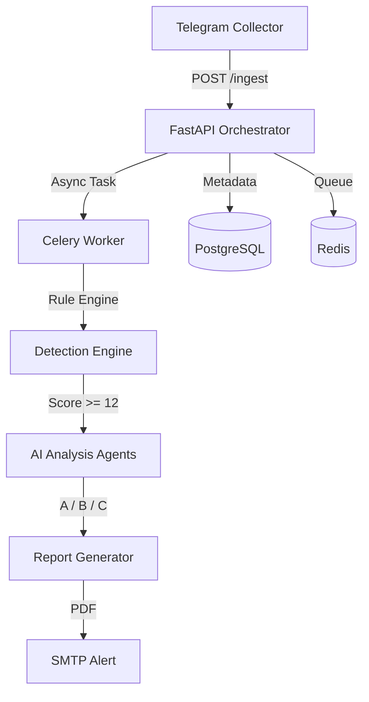

# 🛡️ Telegram OSINT/CTI Platform
### Developed by **[MuRDoK-1982-](https://github.com/MuRDoK-1982-)**


A modular, auditable, and scalable ecosystem designed for early detection of high-impact risks in public Telegram groups. This platform combines advanced MTProto collection, multi-language rule engines, and AI-driven forensic analysis to provide actionable intelligence.

---

## 🚀 Core Features

### 📡 Hyper-Efficient Collection
*   **Telethon (MTProto)**: High-performance listener for real-time monitoring of public groups and channels.
*   **Privacy by Design**: Mandatory pseudonymization of all user handles using salted SHA-256 hashes.
*   **Selective Acquisition**: Automatic downloading of media only when high-risk scores are detected.

### 🧠 Advanced Logic Engine
*   **Multi-Language Support**: Specialized rule sets for **ES / EN / AR / RU / ZH / KO**.
*   **Intelligence Normalizer**: Decodes *Arabizi* and *Leetspeak* to bypass common evasion techniques.
*   **Obfuscation Detection**: Heuristic analysis for Base64, Hex, and high-entropy secret sharing.
*   **Fuzzy Matching**: High-precision detection of typosquatted or slightly modified keywords.

### 🕵️ Multi-Agent AI Orchestration
*   **Agent A (Forensic Psychology)**: Detects radicalization patterns, coercion, and behavioral risk signals.
*   **Agent B (Threat Intel)**: Evaluates hybrid threats, coordinated campaigns, and infrastructure sabotage.
*   **Agent C (Strategy)**: Consolidates all findings into professional intelligence reports with TTP mapping.

### 📊 Professional Output
*   **Automated PDF Reports**: Detailed executive summaries, risk metrics, and agent assessments.
*   **Direct Alerts**: Secure SMTP delivery of high-risk intelligence cases.
*   **Sherlock Integration**: Integrated OSINT lookup for cross-platform username presence.

---

## 🏗️ Architecture



---

## 🛠️ Quick Start

### 1. Requirements
Ensure you have **Docker** and **Docker Compose** installed.

### 2. Configuration
Create a `.env` file based on the provided `.env.example`:
```bash
cp .env.example .env
# Edit .env with your TG_API_ID, TG_API_HASH and OPENAI_API_KEY
```

### 3. Launch
```bash
docker-compose up --build -d
```

---

## ⚖️ Ethical Use & Compliance
This system is designed for **defensive use cases**, law enforcement support, and corporate threat intelligence. It maintains immutable audit logs for every ingestion and analysis action to ensure operational accountability.

---

## 👨‍💻 Author
**MuRDoK-1982-**  
*Senior OSINT/CTI Architect & Python Backend Engineer*

*Disclaimer: This platform belongs to MuRDoK-1982-. Unauthorized distribution is strictly monitored.*
