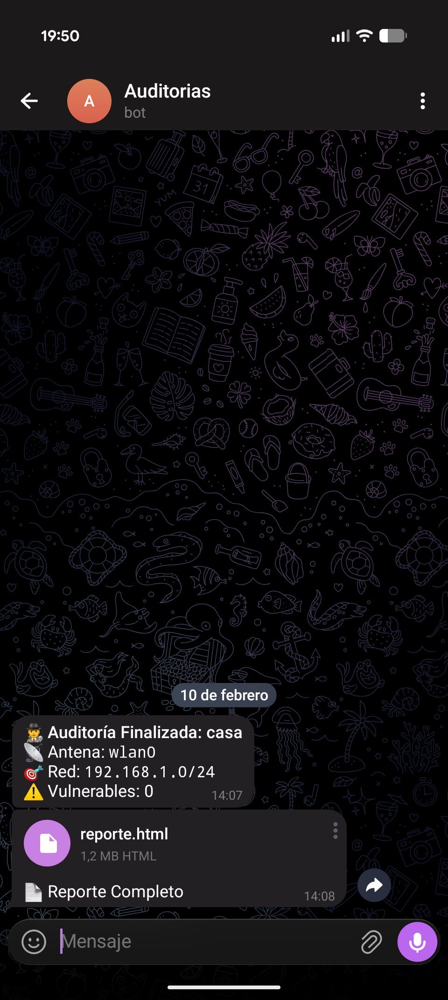
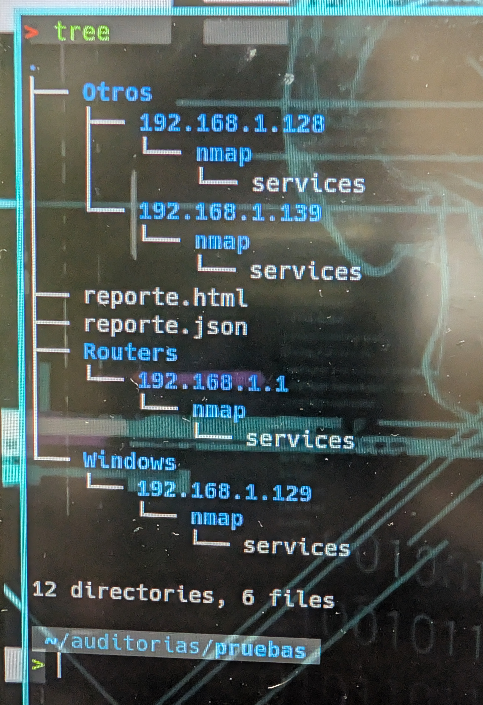

# 🛡️ NetAudit-Suite

> **Suite de auditoría de red automatizada y modular.**

NetAudit-Suite es un conjunto de herramientas diseñadas para **descubrir activos**, **identificar fabricantes** y **detectar vulnerabilidades (CVEs)** en redes locales. 

Incluye versiones optimizadas para hardware de alto rendimiento (PC) y dispositivos IoT de bajo consumo (Raspberry Pi Zero), con integración directa a **Telegram** para reportes en tiempo real.


## 🚀 Módulos Incluidos

| Módulo | Ruta | Descripción | Hardware Recomendado |
| :--- | :--- | :--- | :--- |
| **Core Pro** | `core/audit_pro.py` | Escaneo multi-hilo agresivo. | PC / Laptop / RPi 4 |
| **Lite IoT** | `lite/audit_pi.py` | Optimizado para bajo consumo y selección de interfaz. | Raspberry Pi Zero / Zero 2W |

## 📦 Instalación

1. **Clonar el repositorio:**
   ```bash
   git clone [https://github.com/v1l4x/NetAudit-Suite.git](https://github.com/v1l4x/NetAudit-Suite.git)
   cd NetAudit-Suite
   ```

2. **Instalar dependencias:**
   ```bash
    pip3 install -r requirements.txt
    sudo apt install nmap
   ```
3. **Configuración (Opcional para Telegram):**
   ```bash
    mv config.py.example config.py
    nano config.py
    # Pega tu Token y Chat ID dentro
   ```

## 🎮 Uso

### Modo PC (Potencia Máxima):
```bash
sudo python3 core/audit_pro.py
```
### Modo Raspberry Pi zero 2w (Portable):
```bash
sudo python3 lite/audit_pi.py
```
---

## 📸 Galería del Proyecto

<table align="center">
  <tr>
    <td align="center" width="45%">
      
      <br>
      <sub>Ejecución en Terminal</sub>
    </td>
    <td align="center" width="25%">
      
      <br>
      <sub>Reporte en Telegram</sub>
    </td>
    <td align="center" width="33%">
      
      <br>
      <sub>Entorno de Trabajo</sub>
    </td>
  </tr>
</table>

---


**Disclaimer:** Herramienta creada con fines educativos y de auditoría ética. El autor no se hace responsable del mal uso.

---

## 🎖️ CENTRO DE COMUNICACIONES Y REPORTES OFICIALES
**NIVEL DE ACCESO:** AUTORIZADO | **DESTINATARIO:** COMANDANCIA DE DESARROLLO (gustavolobatoclara@gmail.com)

A través del siguiente portal de comunicaciones, el personal autorizado puede emitir reportes de incidencias, fallas críticas en despliegue (compilación) o solicitudes de mejoras estratégicas. Seleccione la directiva correspondiente para visualizar los protocolos de envío:

<details>
<summary><b>🚨 REPORTAR QUEJA O INCIDENCIA DISCIPLINARIA / OPERATIVA</b></summary>
<br>
Para tramitar una queja sobre el funcionamiento, estructura o contenido del sistema, envíe un mensaje a <b>gustavolobatoclara@gmail.com</b> siguiendo este protocolo:
<ol>
  <li><b>Asunto:</b> [QUEJA] - Nombre del Sistema - Breve descripción.</li>
  <li><b>Cuerpo del mensaje:</b> Detallar claramente la incidencia, impacto operativo y, si es posible, la evidencia (capturas o logs).</li>
  <li><b>Prioridad:</b> Indicar si es de atención inmediata o diferida.</li>
</ol>
</details>

<details>
<summary><b>🛠️ REPORTE DE PROBLEMAS DE COMPILACIÓN O DESPLIEGUE</b></summary>
<br>
Si experimenta fallos durante la fase de compilación o instalación del sistema, reporte a <b>gustavolobatoclara@gmail.com</b> con la siguiente estructura técnica:
<ol>
  <li><b>Asunto:</b> [COMPILACIÓN] - Falla en entorno &lt;Entorno/OS&gt;.</li>
  <li><b>Especificaciones:</b> Sistema Operativo, versión de dependencias y herramientas de compilación utilizadas.</li>
  <li><b>Traza de Error (Logs):</b> Adjunte el log completo de errores proporcionado por la terminal (en formato texto o captura legible).</li>
  <li><b>Pasos de Reproducción:</b> Secuencia exacta de comandos ejecutados antes del fallo crítico.</li>
</ol>
</details>

<details>
<summary><b>💡 SUGERENCIAS O SOLICITUDES DE DESARROLLO</b></summary>
<br>
Para proponer nuevas capacidades tácticas, módulos de inteligencia o mejoras de arquitectura, envíe su solicitud a <b>gustavolobatoclara@gmail.com</b>:
<ol>
  <li><b>Asunto:</b> [PROPUESTA] - Mejora o Nuevo Módulo.</li>
  <li><b>Objetivo Táctico:</b> ¿Qué problema resuelve o qué ventaja proporciona esta nueva característica?</li>
  <li><b>Viabilidad:</b> (Opcional) Posible enfoque técnico o herramientas recomendadas para su implementación.</li>
</ol>
</details>

---
